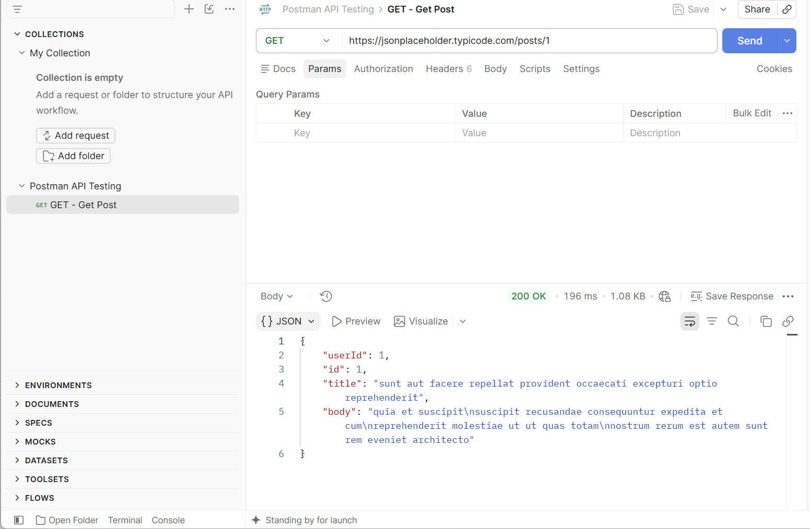
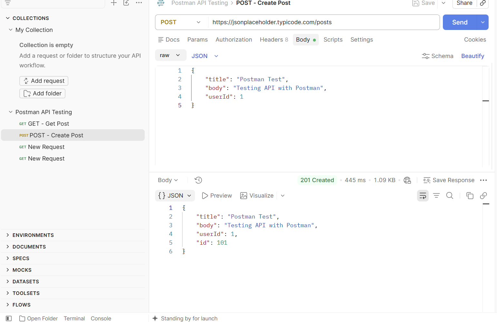
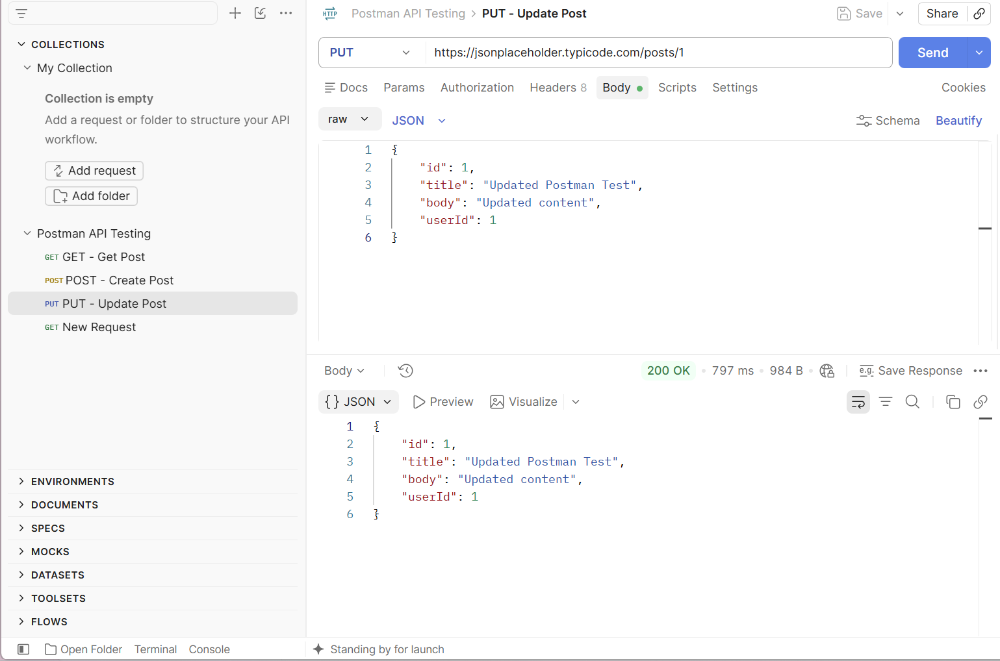
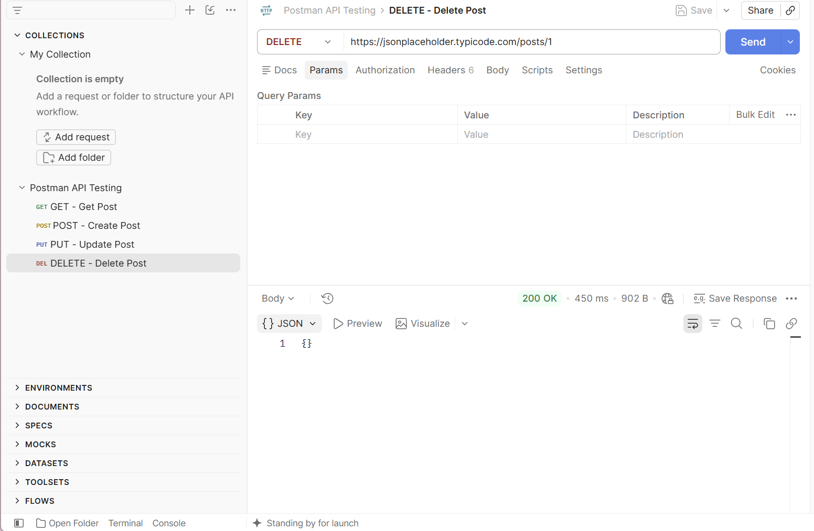
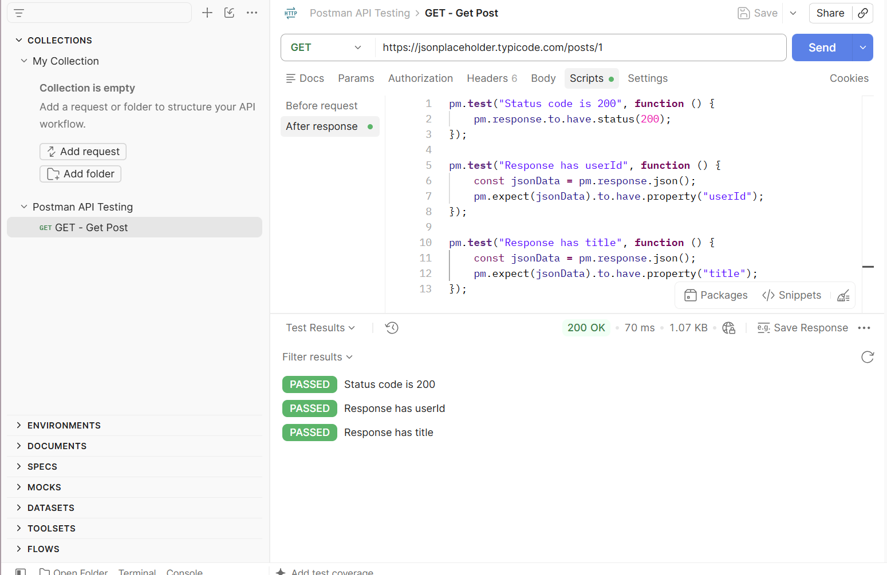
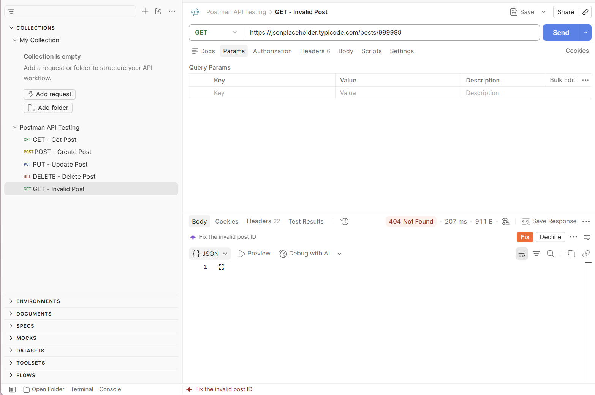
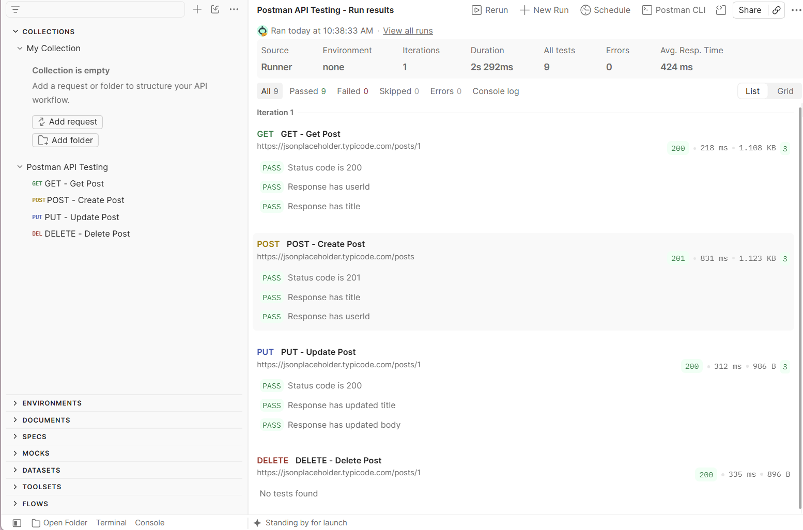

# BÁO CÁO TÌM HIỂU VÀ KIỂM THỬ API BẰNG POSTMAN

## 1. Thông tin

* **Họ và tên:** Đỗ Quỳnh Chi
* **MSSV:** 23010618
* **Công cụ:** Postman
* **API sử dụng:** JSONPlaceholder

## 2. Mục tiêu

Bài thực hành nhằm tìm hiểu cách sử dụng công cụ Postman để kiểm thử API.

Các nội dung thực hiện:

* Tạo và gửi HTTP Request.
* Sử dụng các phương thức GET, POST, PUT, DELETE.
* Kiểm tra HTTP Status Code và Response.
* Viết Test Script để kiểm tra kết quả API.
* Sử dụng Collection Runner để chạy nhiều request.
* Thực hiện kiểm thử trường hợp dữ liệu không hợp lệ.

---

## 3. Giới thiệu về Postman

Postman là công cụ hỗ trợ phát triển và kiểm thử API. Công cụ cho phép người dùng gửi các HTTP Request đến server và kiểm tra Response trả về.

Postman hỗ trợ nhiều phương thức HTTP như GET, POST, PUT, PATCH và DELETE. Ngoài ra, Postman còn cho phép viết Test Script để tự động kiểm tra kết quả của API.

---

## 4. Tài liệu tham khảo

* Video hướng dẫn được cung cấp:
  https://www.youtube.com/watch?v=MFxk5BZulVU

* Postman Documentation:
  https://learning.postman.com/

---

# 5. API sử dụng

Trong bài thực hành, sử dụng API giả lập **JSONPlaceholder**.

URL:

```text
https://jsonplaceholder.typicode.com/
```

Các endpoint được sử dụng:

| Phương thức | Endpoint   | Mục đích               |
| ----------- | ---------- | ---------------------- |
| GET         | `/posts/1` | Lấy thông tin bài viết |
| POST        | `/posts`   | Tạo bài viết           |
| PUT         | `/posts/1` | Cập nhật bài viết      |
| DELETE      | `/posts/1` | Xóa bài viết           |

---

# 6. Thực hiện kiểm thử

## 6.1. GET Request

### Mục đích

Kiểm tra khả năng lấy dữ liệu của API.

### Request

```text
GET https://jsonplaceholder.typicode.com/posts/1
```

### Kết quả

Server trả về mã trạng thái:

```text
200 OK
```

Response trả về thông tin bài viết:

```json
{
    "userId": 1,
    "id": 1,
    "title": "sunt aut facere repellat provident occaecati excepturi optio reprehenderit",
    "body": "quia et suscipit..."
}
```

### Hình ảnh kết quả



---

## 6.2. POST Request

### Mục đích

Kiểm tra khả năng tạo dữ liệu mới.

### Request

```text
POST https://jsonplaceholder.typicode.com/posts
```

### Request Body

```json
{
    "title": "Postman Test",
    "body": "Testing API with Postman",
    "userId": 1
}
```

### Kết quả

Request được thực hiện thành công. API trả về thông tin dữ liệu đã gửi.

### Hình ảnh kết quả



---

## 6.3. PUT Request

### Mục đích

Kiểm tra khả năng cập nhật dữ liệu.

### Request

```text
PUT https://jsonplaceholder.typicode.com/posts/1
```

### Request Body

```json
{
    "id": 1,
    "title": "Updated Postman Test",
    "body": "Updated content",
    "userId": 1
}
```

### Kết quả

Server trả về:

```text
200 OK
```

Response chứa dữ liệu sau khi cập nhật.

### Hình ảnh kết quả



---

## 6.4. DELETE Request

### Mục đích

Kiểm tra khả năng xóa dữ liệu.

### Request

```text
DELETE https://jsonplaceholder.typicode.com/posts/1
```

### Kết quả

Server trả về:

```text
200 OK
```

Request được xử lý thành công.

### Hình ảnh kết quả



---

# 7. Kiểm thử bằng Test Script

Postman cho phép sử dụng JavaScript để tự động kiểm tra Response sau khi gửi Request.

## 7.1. Test GET

Đã thực hiện các kiểm tra:

* Kiểm tra Status Code bằng 200.
* Kiểm tra Response có trường `userId`.
* Kiểm tra Response có trường `title`.

Code:

```javascript
pm.test("Status code is 200", function () {
    pm.response.to.have.status(200);
});

pm.test("Response has userId", function () {
    const jsonData = pm.response.json();
    pm.expect(jsonData).to.have.property("userId");
});

pm.test("Response has title", function () {
    const jsonData = pm.response.json();
    pm.expect(jsonData).to.have.property("title");
});
```

Kết quả các test đều PASS.



---

## 7.2. Test POST

Các nội dung kiểm tra:

* Kiểm tra Status Code bằng 201.
* Kiểm tra Response có trường `title`.
* Kiểm tra Response có trường `userId`.

```javascript
pm.test("Status code is 201", function () {
    pm.response.to.have.status(201);
});

pm.test("Response has title", function () {
    const jsonData = pm.response.json();
    pm.expect(jsonData).to.have.property("title");
});

pm.test("Response has userId", function () {
    const jsonData = pm.response.json();
    pm.expect(jsonData).to.have.property("userId");
});
```

---

## 7.3. Test PUT

Các nội dung kiểm tra:

* Kiểm tra Status Code bằng 200.
* Kiểm tra tiêu đề sau khi cập nhật.
* Kiểm tra nội dung sau khi cập nhật.

```javascript
pm.test("Status code is 200", function () {
    pm.response.to.have.status(200);
});

pm.test("Response has updated title", function () {
    const jsonData = pm.response.json();
    pm.expect(jsonData.title).to.eql("Updated Postman Test");
});

pm.test("Response has updated body", function () {
    const jsonData = pm.response.json();
    pm.expect(jsonData.body).to.eql("Updated content");
});
```

---

## 7.4. Test DELETE

Kiểm tra Status Code:

```javascript
pm.test("Status code is 200", function () {
    pm.response.to.have.status(200);
});
```

---

# 8. Kiểm thử trường hợp không hợp lệ

Để kiểm tra khả năng xử lý dữ liệu không hợp lệ, thực hiện request:

```text
GET https://jsonplaceholder.typicode.com/posts/999999
```

ID `999999` không tồn tại.

Kết quả:

```text
404 Not Found
```

Điều này cho thấy API có phản hồi phù hợp khi yêu cầu dữ liệu không tồn tại.



---

# 9. Collection Runner

Các request GET, POST, PUT và DELETE được đưa vào cùng một Collection và thực hiện chạy bằng Collection Runner.

Các request được chạy:

```text
GET - Get Post
POST - Create Post
PUT - Update Post
DELETE - Delete Post
```

Kết quả:

* Các request được thực hiện thành công.
* Các Test Script đã thiết lập đều được Postman kiểm tra.
* Các test hợp lệ đều PASS.



---

# 10. Kết quả đạt được

Sau khi thực hành, em đã thực hiện được:

| Nội dung                      | Kết quả |
| ----------------------------- | ------- |
| Gửi GET Request               | Đạt     |
| Gửi POST Request              | Đạt     |
| Gửi PUT Request               | Đạt     |
| Gửi DELETE Request            | Đạt     |
| Kiểm tra Status Code          | Đạt     |
| Viết Test Script              | Đạt     |
| Kiểm thử dữ liệu không hợp lệ | Đạt     |
| Sử dụng Collection Runner     | Đạt     |

---

# 11. Kết luận

Qua bài thực hành, em đã hiểu được cách sử dụng Postman để kiểm thử API. Em đã thực hiện các phương thức GET, POST, PUT và DELETE, kiểm tra Response và Status Code, đồng thời sử dụng Test Script để tự động kiểm tra kết quả.

Ngoài ra, việc sử dụng Collection Runner giúp chạy nhiều request liên tiếp và kiểm tra kết quả kiểm thử một cách thuận tiện hơn.

Postman là một công cụ hữu ích trong kiểm thử API và có thể hỗ trợ tester phát hiện lỗi trong quá trình phát triển phần mềm.
